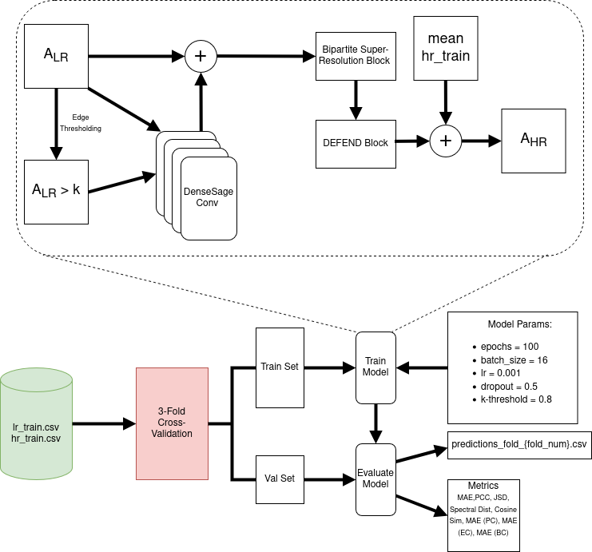
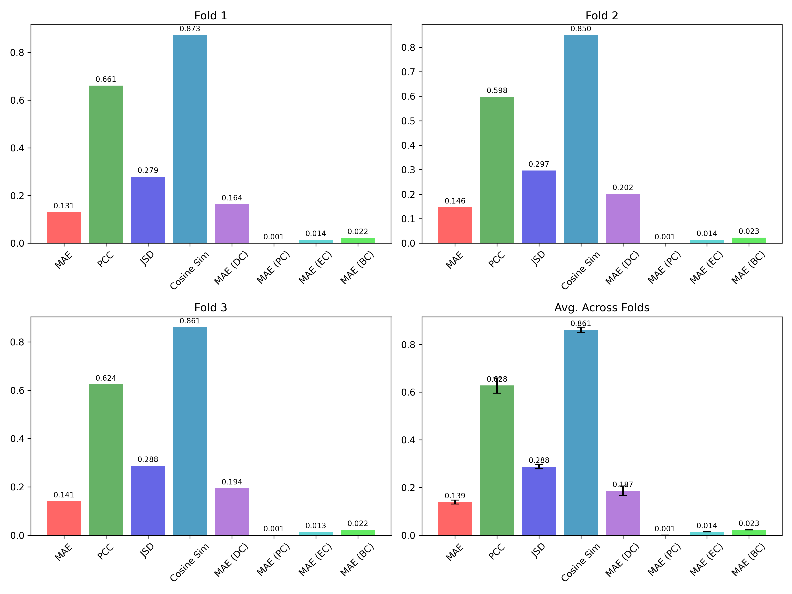

# BiRD-Brain: **Bi**partite **R**esidual **D**ual-graph network for **Brain** super-resolution 

## Contributors

- Temi Messmer
- Daniel Sanchez Sanchez
- Nicholas Scheurenbrand
- Vikneswarean Indiran

## Problem Description

The objective is to design a generative Graph Neural Network (GNN) trained in an inductive setting to predict high-resolution (HR) brain connectivity graphs from low-resolution (LR) counterparts. The data is represented as symmetric weighted connectivity matrices where each element quantifies the neural correlation between two distinct brain regions. 
Given an LR connectivity matrix $\mathbf{A}^{LR} \in \mathbb{R}^{160 \times 160}$, the model must generate the corresponding HR connectivity matrix $\mathbf{A}^{HR} \in \mathbb{R}^{268 \times 268}$ of the same brain. Mathematically, the goal is to learn a mapping $f$ such that: $$f(\mathbf{A}^{LR}) = \hat{\mathbf{A}}^{HR} \approx \mathbf{A}^{HR}$$ where $\hat{\mathbf{A}}^{HR}$ is the adjacency matrix predicted by the GNN model $f$.

Enhancing brain graph resolution computationally offers significant benefits for neuroscience and clinical imaging. Obtaining high-resolution brain scans is often expensive and time-consuming. By framing this as a graph super-resolution problem, researchers can artificially upgrade legacy or lower-quality clinical data to extract fine-grained neural insights without requiring new physical scans. Furthermore, this challenge pushes the boundaries of geometric deep learning. It requires the model to learn complex topological structures and generalize to unseen brain graphs in an inductive setting.

## Methodology

#### Graph Convolutional Network
Extracts structural features from the low resolution input graph using GraphSAGE layers and applies a residual connection to enrich the original node features.

#### BiSR Module
Projects the enriched low resolution node features into high resolution node embeddings by applying a linear transformation and a low rank bilinear projection matrix.

#### DEFEND Module
Generates pairwise edge features by concatenating the sum and absolute difference of the high resolution node embeddings. It then passes these features through a multi layer perceptron to predict edge weights and construct a symmetric residual adjacency matrix.

#### Final Reconstruction
Adds the predicted residual matrix to the mean of targets of the training set and clamps the values between 0 and 1 to produce the final high resolution graph adjacency matrix.



## Used External Libraries

All required dependencies can be installed using:

```bash
pip install -r requirements.txt
```

Key libraries used in this project:

- **PyTorch** (>=2.2.0): Deep learning framework for neural network implementation
- **PyTorch Geometric** (>=2.5.0): Geometric deep learning library for graph neural networks
- **scikit-learn** (>=1.4.0): Machine learning utilities for cross-validation and metrics
- **pandas** (>=2.2.0): Data manipulation and CSV handling
- **numpy** (>=1.26.0): Numerical computations
- **matplotlib** (>=3.8.0): Visualization and plotting
- **scipy** (>=1.12.0): Scientific computing, including Jensen-Shannon distance
- **NetworkX** (>=3.2.0): Graph algorithms and centrality measures
- **tqdm** (>=4.66.0): Progress bars for training loops
- **Jupyter** (>=1.0.0): Interactive notebook environment

For CUDA support (GPU acceleration), ensure you have the appropriate CUDA toolkit installed before installing PyTorch.

## Results



The model was evaluated using 3-fold cross-validation across 8 evaluation metrics:
- **MAE**: Mean Absolute Error on adjacency matrices
- **PCC**: Pearson Correlation Coefficient
- **JSD**: Jensen-Shannon Distance 
- **Cosine Similarity**: Cosine similarity between flattened predictions and targets
- **MAE (Degree Centrality)**: Mean Absolute Error of node degree centrality
- **MAE (PageRank Centrality)**: Mean Absolute Error of PageRank scores
- **MAE (Eigenvector Centrality)**: Mean Absolute Error of eigenvector centrality
- **MAE (Betweenness Centrality)**: Mean Absolute Error of betweenness centrality

Detailed metrics for each fold are available in `evaluation_results/cv_fold_metrics.csv`.


## References

- W. Hamilton, Z. Ying, and J. Leskovec, “Inductive representation learning on large graphs,” Advances in neural information processing systems, vol. 30, 2017.
- P. Singh and I. Rekik, “Rethinking graph super-resolution: Dual frameworks for topological fidelity,” 2025. [Online]. Available: https:
//arxiv.org/abs/2511.08853
